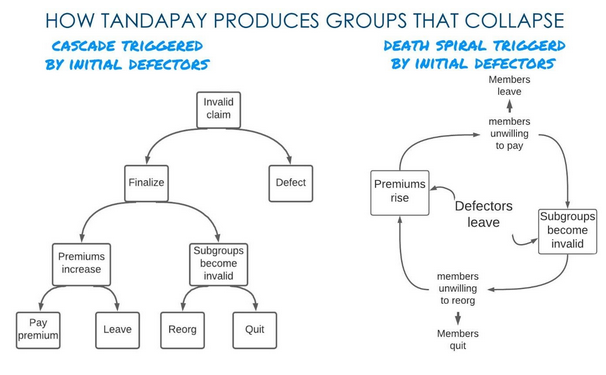
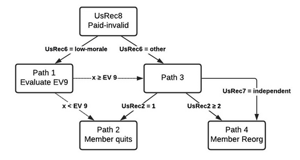
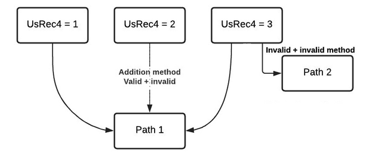

# Background

All modern insurance architectures require that a provider hold funds in reserve for paying future claims. Even models that function outside modern insurance principles such as a takaful (risk sharing groups compliant with Islamic law) are required to use custodians who hold reserves for the purpose of paying future claims. No one has ever seen a working model of insurance that is capable of paying claims that has no custodians and holds no reserves. If it was possible to build a policy using zero-reserve architecture then almost nothing would be known about how these types of architectures would function and what incentive structures would govern the participants.

TandaPay is a zero-reserve architecture that is optimized to produce groups that collapse when invalid claims are submitted for payment. The TandaPay architecture was created to produce incentive structures that maximize for the attribute of intolerance when it comes to dishonest reports by the members. This makes TandaPay an excellent protocol for whistleblowing software because the threat of collapse should theoretically create a willingness for the group to self-censor in order to maintain its existence. Only claims that are viewed by a super majority (above 90% of participants) as valid should ever be approved for payment.

Given the assumption that 40% (or more) of the members are honest, the TandaPay protocol can be proven to have the property of group collapse in response to submission of an invalid claim. What is currently unknown is the minimum threshold of honest participants required to produce this type of collapse. If the threshold required to collapse a group can be proven to be very low, then the degree to which the group self-censors claims should be correspondingly very high.

This dynamic can allow entities outside of the community to have a greater sense of certainty as to a claims validity without knowing the contents of a claim. In this way, the architecture, which would threaten to collapse a group for approving an invalid claim is the same architecture that would bolster credibility of the group for approving a valid claim.

What is needed is a simulation that explores different group attributes to determine which architecture is best optimized to produce groups which collapse with the minimum number of honest participants.

# Background as it pertains to tandaPay

Zero-reserve escrow technology for setting up insurance mutuals is new. In addition to not holding reserves, the architecture permits members to defect against invalid claims. These defections result in a hefty cost upon members who decide to remain in the community. As members leave, premiums can sharply rise, and it is the rise of premiums that can trigger a chain of events that result in group collapse.

There is a potential novelty associated with determining the honesty of an insurance claim using defections. Insurance mutuals have previously not permitted policyholders to leave the group with a refund of their premium, so little is known about this mechanic. A mechanism that permits defectors within the context of a zero-reserve group has never previously been explored by an academic paper.

Coverage requirements are inflexible demands enforced by smart contracts that claims be paid in full. They mandate that any remaining members make up for the value of premiums that were refunded to defectors. This means that a defectors denial of payment to a claimant requires remaining members to pay an additional cost to make up for this loss.

When coverage requirements are mandated by the system, it causes premiums to increase as members leave the group. Potentially the pairing of these three attributes can produce groups with the property of collapse as a result of a failure to reach consensus on the validity of an insurance claim. It is currently unknown if groups with these attributes can deterministically produce collapse when less than one-third of participants are honest. It is also unknown if there is a threshold of honest participants required to reliably produce collapse.

If it can be shown that the required threshold of a dissenting minority capable of producing group collapse is between 20 to 30% of participants, then the implications related to game theory for determining the honesty of an insurance claim will likely be of profound consequence. The threat of collapse gives the minority an effective means of imposing self-censorship upon the majority. The smaller the minority of honest participants that are required who can effectively prevent a supermajority from colluding to approve an invalid claim, the more an approved claim provides a valuable signal to entities outside of the group. If group collapse (or lack thereof) can become a reliable heuristic (to outsiders) for determining the honesty of an insurance claim then the group has an effective means of generating a historical record that has statistical significance.

# Goal of THE simulation

It is currently unknown if combining zero-reserve architecture and coverage requirements with a mechanism that permits defections can deterministically produce group collapse when a group&#39;s consensus is fractured. If it can be shown that a small dissenting minority can produce sharply rising premiums that effectively result in group collapse, then the implications related to game theory may be of profound consequence. Having an architecture where the threshold of honest participants required to produce collapse is known is likely to be valuable. If TandaPay is one day widely available, models capable of providing the probability that an insurance claim is valid based upon the group&#39;s historical record located on the blockchain are therefore also likely to be valuable.

The goal of the simulation is to produce a large and robust data set where multiple variables are evaluated. This data set should correlate architecture with specific starting assumptions to specific group properties. Said another way, the starting assumptions are that smart contracts can enforce inflexible coverage requirements and rising premiums as people defect, skip, or quit (i.e., when a group fractures). Can these starting assumptions be correlated with groups that collapse with a known threshold of honest defectors?

Once correlation is demonstrated, further research may be able to prove a causal relationship between architecture with specific assumptions producing groups with specific properties.

# What is new about TandaPay

TandaPay uses the blockchain to eliminate third party custodians and the ability for smart contracts to enforce inflexible coverage requirements. Previous research into groups such as broodfonds (breadfunds) and ROSCAs did not focus on the attributes of smart contracts being used to strictly enforce that premiums rise as a result of a fracture. Smart contract inflexibility is generally an underappreciated attribute that TandaPay heavily exploits.

In addition, other approaches did not utilize subgroups. Subgroups are important because they provide novel group dynamics that have also been previously underappreciated such as:

- The decrease in the signal to noise ratio. Subgroups allow defections to be categorized as either honest or selfish.
- This feature is not tested by the simulation, but is part of an initial set of assumptions.
- Architectures that use subgroups prohibit members from obtaining coverage as individuals; effectively outsourcing the cost of underwriting policies to the group.
- This feature is not tested by the simulation, but is part of an initial set of assumptions.
- Architectures that use subgroups accelerate group collapse when consensus is fractured because invalid groups impose costs in terms of morale and increased premiums.
- The simulation tests this hypothesis.
- Architectures that use subgroups inhibit members from acting as individuals by effectively imposing a cost associated with selfish defections and removing that same cost for honest defections.
- This feature is not tested by the simulation, but is part of an initial set of assumptions.

# Conclusion

The virtue of architecture that can deterministically produce collapse when a group&#39;s consensus is fractured is underappreciated. There are thousands of valid configurations for these types of groups. Finding the optimal configuration for collapse will require research, modeling, and the creation of simulations.

# Relationship between ev4 and pv5

The simulation specifies a number of different variables, but the purpose of the simulation is to derive the relationship between the initial number of defectors and the number of members remaining once the group collapses.

## Definition of PV5

Pricing Variable (PV)5 translates premium prices into group collapse. As members leave, premiums rise for the remaining participants. A group is only allowed to lower the cost of their monthly premiums if no members have left the group in the past 30 days as a result of defections, skipped payments, or a failure to reorg (i.e., quit). PV5 specifies a threshold that the group is unable to stop members from skipping out on paying premiums. Although the variable specifies the degree that premiums are required to rise, this can be directly translated to the number of members remaining once the PV5 threshold is crossed by using the following formula:

The above formula can be derived from:

or

and

## Definition of EV4

Environmental Variable (EV)4 is the number of members who act as honest defectors at the start of the simulation. If enough members defect in the initial wave, their actions result in a chain of events that can push the group over the PV5 threshold. If this happens, the group is effectively unable to continue.

If the number of members specified in PV4 is insufficient, the group will not cross the PV5 threshold and will be capable of changing their coverage requirement thereby enabling members to lower their premiums and avert group collapse.

# Input module

[Create user interface for entering in relevant simulation variables]

# Environmental variables (EV)

Table 1 outlines the EVs used in the simulation and their allowed values.

_**Table 1. Environmental Variables (EVs)**_

| **Variable Name** | **Variable Definition** | **Allowed Values** |
| --- | --- | --- |
| EV1 | How many members are in the group? |  |
| EV2 | Average take home pay for group members? |  |
| EV3 | What is the chance of a claim each month? | 25 – 75 |
| EV4 | What is the percentage of honest defectors? | 10 – 45 |
| EV5 | What is the percentage of low-morale members? | 10 – 30 |
| EV6 | What is the percentage of members who are unwilling to act alone? | 20 – 80 |
| EV7 | What is the member threshold needed for dependent members to defect? | 2, 3, 4 |
| EV8 | Poison group for x periods | 0, 1, 2, 3 Default = 3 |
| EV9 | Probability a low-morale member will quit if forced to reorg | 0.3333 |
| EV10 | Coverage requirement |  |
| EV11 | Number of remaining members that play a unity role |  |
| EV12 | Number of remaining members that play a role of independent |  |

# Pricing variables (PV)

The following outlines the different PVs used in the simulation, what questions they aim to answer, and their allowed values.

**Question PV1, PV2, PV3, and PV4 are answering:** What is the premium price sensitivity relative to the previous month?

**PV1 and PV2:** PV1 and PV2 determine the bottom of the threshold, which corresponds to the lowest price impact. The relationship between PV1 and PV2 is as follows:

- PV1 = If the premium price increases by **&lt; insert % between 20 – 40% &gt;**
- PV2 = Then **&lt; insert % between 1 – 15% &gt;** of policyholders leave

**PV3 and PV4:** PV3 and PV4 determine the top of the threshold, which corresponds to the greatest price impact. The relationship between PV3 and PV4 is as follows:

- PV3 = If the premium price increases by **&lt;insert % between 30 – 60%&gt;**
- PV4 = Then **&lt;insert % between 5 – 25%&gt;** of policyholders leave

**Question PV5 and PV6 are answering:** What is the premium price sensitivity relative to pre-facture?

- PV5 = If the premium price increases by **&lt;insert percentage&gt;**
- PV6 = Then **&lt;insert percentage&gt;** of policyholders leave

**Note:** Auto populate suggestions for PV3 and PV4 based on PV1 and PV2. Suggestions may be modified by the user.

**Note:** Auto populate suggestions for PV5 and PV6 based on PV1 and PV2. Suggestions may be modified by the user.

**Note:** When automating multiple runs, variables are ranked in order of importance as seen here.

## PV Rules

Rules for PVs include the following:

- PV3 &gt; PV1 and PV4 &gt; PV2
- PV5 &gt; PV3

# Goal: Create system generator module

Take initial variables as user inputs and use functions to produce database entries as outputs.

## Database module

The database module is designed to create, store, and update data using system data and user data.

### System Data

System data functions to keep a record of the results and determines what the system will do next.

- Period data occupies the rows of the database
- System record occupies columns of the database

### User Data

User data determines what the user will do next.

- User number occupies rows of the database
- User record occupies columns of the database

## System database

The system database creates 10 periods composed of 30 stages as shown in order below. Stages 5, 8, 11, 14, 17, 20, 23, 26, 29 are not use as a functional part of the simulation.

Stage 1. Pay premiums stage for Period 1

Stage 2. Finalize claims stage for Period 0

Stage 3. Reorg subgroups stage for Period 1

Stage 4. Pay premiums stage for Period 2

Stage 5. Finalize claims stage for Period 1

Stage 6. Reorg subgroups stage for Period 2

Stage 7. Pay premiums stage for Period 3

Stage 8. Finalize claims stage for Period 2

Stage 9. Reorg subgroups stage for Period 3

Stage 10. Pay premiums stage for Period 4

Stage 11. Finalize claims stage for Period 3

Stage 12. Reorg subgroups stage for Period 4

Stage 13. Pay premiums stage for Period 5

Stage 14. Finalize claims stage for Period 4

Stage 15. Reorg subgroups stage for Period 5

Stage 16. Pay premiums stage for Period 6

Stage 17. Finalize claims stage for Period 5

Stage 18. Reorg subgroups stage for Period 6

Stage 19. Pay premiums stage for Period 7

Stage 20. Finalize claims stage for Period 6

Stage 21. Reorg subgroups stage for Period 7

Stage 22. Pay premiums stage for Period 8

Stage 23. Finalize claims stage for Period 7

Stage 24. Reorg subgroups stage for Period 8

Stage 25. Pay premiums stage for Period 9

Stage 26. Finalize claims stage for Period 8

Stage 27. Reorg subgroups stage for Period 9

Stage 28. Pay premiums stage for Period 10

Stage 29. Finalize claims stage for Period 9

Stage 30. Reorg subgroups stage for period 10

### System record (SyRec) variables

Table 2 provides details regarding the System Record (SyRec) variables. These variables keep track of decisions made by the users. Choices users make have an impact on the cost that a member must pay to continue to receive coverage. As members leave the system record charts the groups progress and enforces that premiums rise in response.

_**Table 2. System Record (SyRec) Variables**_

| **Variable Name** | **Variable Definition** | **Initial Values** |
| --- | --- | --- |
| SyRec1 | Valid members remaining | EV1 |
| SyRec2 | Premium for a single member |  |
| SyRec3 | Number of defected members | 0 |
| SyRec4 | Number of paid members | 0 |
| SyRec5 | Number of members skipped | 0 |
| SyRec6 | Number of invalid members | 0 |
| SyRec7 | Number of members that quit | 0 |
| SyRec8 | Number of reorged members | 0 |
| SyRec9 | Fracture debt from defections | 0 |
| SyRec10 | Fracture debt from skips new | 0 |
| SyRec11 | Fracture debt from skips prior | 0 |
| SyRec12 | Fracture debt from invalid new | 0 |
| SyRec13 | Fracture debt from invalid prior | 0 |
| SyRec14 | Fracture debt total | 0 |
| SyRec15 | Fracture debt per member | No |
| SyRec16 | Claims this period | 0 |
| SyRec17 | Refund value available for new members | 0 |
| SyRec18 | Refund value available for prior members | 0 |
| SyRec19 | Generic total payment |  |

## User database

The user database consists of a user&#39;s primary and secondary roles and the current status of the user. These roles and the user&#39;s status determine what decisions they will need to make as the simulation progresses.

### User record (UsRec) variables

Table 3 provides details regarding the User Record (UsRec) variables.

_**Table 3. User Record (UsRec) Variables**_

| **Variable Name** | **Variable Definition** | **Initial Values** |
| --- | --- | --- |
| UsRec1 | Original assigned subgroup number | Generated by the subgroup setup |
| UsRec2 | Number of members remaining from original subgroup | Generated by the subgroup setup |
| UsRec3 | Current assigned subgroup number | Generated by the subgroup setup |
| UsRec4 | Number of members in current subgroup | Generated by the subgroup setup |
| UsRec5 | Status of subgroup Accepted values: Valid, Invalid, or NR | Generated by the subgroup setup |
| UsRec6 | Primary role Accepted values: Defector, Low-Morale, or Unity | Generated by the role assignment |
| UsRec7 | Secondary roleAccepted values: Dependent or independent | Generated by the role assignment |
| UsRec8 | Current statusAccepted values: Defected, Paid, Skipped, Paid-Invalid, Quit, Reorg, or NR | Paid |
| UsRec9 | Number of times they have reorged | 0 |
| UsRec10 | Value of invalid refund available | 0 |
| UsRec11 | Total payment specific user | EV1 |
| UsRec12 | A member&#39;s ability to pay this periodAccepted values: Yes, No, or NR | Yes |
| UsRec13 | Defector counter | 0 |

## Initialization functions

The simulation utilizes the following initialization functions:

- Subgroup setup module
- Role assignment module

### Subgroup setup

**Note:** To see the subgroup setup function performed in Excel, [see this document](https://docs.google.com/spreadsheets/d/1lF42BrWEsvW_A3224bGnQQ0-nhM72QkobPF10YRvvX0/edit?usp=sharing).

The following steps detail the setup of the subgroup:

1. Start with the total number of members (EV1).
2. Divide the total number of members (EV1) by 5.
3. Divide the result of Step 2 by 2.3333 and round to the nearest integer.
4. Multiply the result of Step 3 by 5.
5. Subtract the result of Step 4 from Step 1.
6. Divide the remaining members by 6.
7. Divide the result of Step 6 by 2 and round to the nearest integer.
8. Multiply the result of Step 7 by 6.
9. Subtract the result of Step 8 from Step 5.
10. Divide the remaining members by 7.
11. Divide the result of Step 10 by 2 and round down to the nearest integer.
12. Multiply the result of Step 11 by 7.
13. Subtract the result of Step 12 from Step 9.
14. Using the modulo operator, divide the remaining members by 4 and take the result with the remainder.
  1. If the remainder from Step 14 = 0, then do nothing and continue with Step 15.
  2. If the remainder from Step 14 = 1, 2, or 3 members, then convert one group of 5 into a group of 6, 7, or 2 groups of 4.
    1. If there is a set of 5 member groups, then see Step 3 = A
    2. If there is a set of 6 member groups, then see Step 7 = B
    3. If there is a set of 7 member groups, then see Step 11 = C
    4. If there is a set of 4 member groups, then see Step 14 = D
  3. If the remainder from Step 14 = 1, then set a A - 1 group and a B + 1 group.
  4. If the remainder from Step 14 = 2, then set a A - 1 group and a C + 1 group.
  5. If the remainder from Step 14 = 3, then set a A - 1 group and a D + 2 group.
15. Assign a specific subgroup number to each subgroup.
16. Assign the members to each numbered subgroup.
17. Update the user record based on the subgroup setup.
  1. UsRec1 = Assigned in Step 16
  2. UsRec2 = Assigned in Step 16
  3. UsRec3 = Assigned in Step 16
  4. UsRec4 = Assigned in Step 16
  5. UsRec5 = Initially set to Valid

### Role assignment

The role assignment consists of 2 roles.

The 1st role consists of EV4, EV5, and EV11.

- EV4 – What is the percentage of honest defectors?
- EV5 – What is the percentage of low-morale members?
- EV11 – The number of remaining members that play a unity role

The 2nd role consists of EV6 and EV12.

- EV6 – What is the percentage of members who are unwilling to act alone?
- EV12 – The number of remaining members that play a role of independent

#### Instructions for 1st role assignment 

1.  with the role of Defector
2. Assign the Defector 1st role to participants at random.
  a. Remove these participants from 1st role assignment pool.
3.  with the role of Low-Morale
  a. Assign the Low-Morale 1st role to remaining participants at random.
4. Any members who are not assigned a role are assigned with the role of Unity.
5. 

#### Instructions for 2nd role assignment

6.  with the role of Dependent
  a. Assign the Dependent 2nd role to members of any group where UsRec4 = 4.
  b. If UsRec4 = 4 &gt;  then stop assigning any members the Dependent role.
  c. If UsRec4 = 4 members &lt; , then assign any remaining  assignments at random.
7. Assign remaining members the role of Independent.
8. 

#### Update user record based on role assignment

1. Determine the value of UsRec6 from assigning EV4, EV5, and EV11.
2. Determine the value of UsRec7 from assigning EV6 and EV12.

## How funds move through the system

Coverage requirements mandate that the cost of members who defect or skip their premium payments become deficits for any remaining group members. Figure 1 below charts how payments, which were removed by defectors in Function 1, or were never paid by skipped members in Function 2 become accounted for as debt. This debt is then realized as increased premiums calculated in Function 9 and carried forward to the next period by Function 11. If this debt is high enough, it will produce additional members who skip payment of their premiums in Function 2 and the cycle will repeat.

**Figure 1. How Defections Generate Group Debt**

If a group has no claims in a given month, the premiums must be returned to members as refunds. The process of returning premiums back to members takes about one month before these refunds become available to lower the cost of future premiums. As show in Figure 2 below, Function 8 determines if the current period has a claim, and Function 11 moves that credit forward into the next period. Finally, the credit reduces the members premiums in Function 2 and thus the likelihood that members will skip payment of their premium.

**Figure 2. How Refunds Generate Credits**

## System and user functions module

The following sections explain the system and user functions module. The functions and database work together by utilizing the following:

- Most system or user functions evaluate the user record row by row.
- The function then modifies the user record if certain conditions are met. This modification may also result in a modification of the system record.
- Once all the rows of the user record are completely evaluated, move to the next function.
- The functions move from the Pay Stage to the Finalize Stage and then the Reorg Stage.
- When all stages are complete, advance to the next period in the system record.
- The following includes a step-by-step breakdown of the system and user functions module.

### System and user function breakdown

#### UsFunc1 Detailed Description

**Function name:** UsFunc1 – User defection function

**Stage and period:** Pay Stage 1 – Only run for Period 1

**UsFunc1 input:** UsRec1, UsRec6, UsRec7, and EV7

**Initial check:** Is the simulation currently on Period 1?

- If yes, then continue.
- If no, ?

_Path 0_

1. Path 0 start. Load user record.
2. Count total users in user record = &lt;end of user list&gt;
3. Start with user **&lt;current user #&gt;**.
4. If user **&lt;current user #&gt;** = Defector, then:
	- continue to Path 0.5.
5. Elseif **&lt;current user #&gt;** = **&lt;end of user list&gt;** then: 
	- continue to Path 1.5.
6. Else: 
	- continue with **&lt;current user #&gt; + 1** 
	- go to Path 0 start.

_Path 0.5_

1. If user **&lt;current user #&gt;** UsRec7 = Dependent, then:
	- evaluate Path 1.
2. Else: 
	- add to Path 2 Run Set.
3. If **&lt;current user #&gt;** = **&lt;end of user list&gt;** then: 
	- continue to Path 1.5.
4. Else: 
	- continue with **&lt;current user #&gt; + 1**
	- go to Path 0 start.

_Path 1_

1. For all users where UsRec6 = Defector and UsRec7 = Dependent do:
	- Read **&lt;current user #&gt;** UsRec3 = Load into **&lt;GroupRead&gt;**.
2. For every user where UsRec3 = **&lt;GroupRead&gt;** do:
	- Increment UsRec13 by 1.
3. Clear **&lt;GroupRead&gt;**.
4. If **&lt;current user #&gt;** = **&lt;end of user list&gt;** then: 
	- continue to Path 1.5.
5. Else: 
	- continue with **&lt;current user #&gt; + 1** 
	- go to Path 0 start.

_Path 1.5_

1. For all users where UsRec6 = Defector and UsRec7 = Dependent do:
	- If UsRec13 ≥ EV7 then:
		- add to Path 2 Run Set.
	- Else: 
		- add to Path 3 run set, 
		- load Path 2 Run Set.

_Path 2 Run Set_

1. Decrement SyRec1 by 1.
2. Defecting for previous period.
	- Increment SyRec3 by 1.
3. Skipping for current period.
	- Increment SyRec5 by 1.
4. Referencing UsRec3,
	- Decrease UsRec4 by 1 for all users with same UsRec3 value.
	- Decrease UsRec2 by 1 for all users with same UsRec1 and UsRec3.
	- UsRec3 = 0
	- UsRec4 = 0
	- UsRec5 = NR
	- UsRec8 = NR
	- UsRec12 = NR

_Path 3 Run Set_

1. Load Path 3 Run Set.
2. For all users in Path 3 Run Set do:
	- UsRec6 = Low-Morale
3. Continue to Path 4.

_Path 4_

1. Clear Path 2 Run Set.
2. Clear Path 3 Run Set.
3. Continue to UsFunc2.

#### UsFunc2 Detailed Description

**Function name:** UsFunc2 – User skip function

**Stage:** Pay Stage 2

**UsFunc2 workflow:** The workflow of UsFunc2 is shown below in Figure 3.

**Figure 3. Workflow of UsFunc2**

**At start of simulation:** PV1, PV2, PV3, and PV4

1. Find the slope of price sensitivity relative to the previous month.
2. Pricing slope = 

**Note:** The y-axis represents the percentage of people who will skip their premiums. The x-axis represents the amount (in percent) that the premium price has increased.

_Run each period_

**Initial check:** Is the simulation currently on Period 1?

1. If yes, then: 
	- end the function.
2. Else:
	- continue.

**UsFunc2 input:** SyRec19 for the current period pay stage and SyRec19 for the previous period pay stage.

1. a = SyRec19 for the current period pay stage
2. b = SyRec19 for the previous period pay stage
3.  = % Increase in Premiums
4. If % Increase in Premiums &lt; PV1, then: 
	- continue to Path 2
5. If % Increase in Premiums ≥ PV1, then: 
	- continue to Path 1

_Path 1_

1.  where:
	- y - PV2 = m(% Increase in Premiums - PV1)
	- y = (m * % Increase in Premiums - m * PV1) = PV2
	- y = Skip% = Percent of users who will skip

**Path 1 input:** SyRec1 and Skip%

**Path 1**  **Output:** Skip#

1. Identify group where UsRec5 = Valid.
2. Randomly select (Skip#) number of users where UsRec5 = Valid.
3. Group of skip users = Set of users.
4. Set of users UsRec12 = No.

_Path 2_

1. If  &lt; PV5, then: 
	- continue to Path 3.
2. If  ≥ PV5, then: 
	- determine Skip# to the nearest whole number.
	- Skip# = SyRec1 * PV6
3. Identify group where UsRec5 = Valid.
4. Randomly select (Skip#) number of users where UsRec5 = Valid.
5. Group of skip users = Set of users.
6. Set of users UsRec12 = No

_Path 3_

1. If EV8 = 0, then:
	- do nothing.
2. If EV8 in 1, 2, or 3, then: 
	- decrease EV8 by 1.
	- At random, select 1 user record where UsRec5 = Valid.
	- Update user.
	- UsRec12 = No

**Note:** Once Path 1, Path 2, and Path 3 are completed for all records, continue to SyFunc3.

#### SyFunc3 Detailed Description

**Function name:** SyFunc3 – Validate premium function

**Stage:** Pay Stage 3

**Input:** UsRec12

_Path 0 Initialization_

1. Load user record.
2. Create user list from user record where UsRec5 = Valid.
3. Count users in list = **&lt;end of user list&gt;**.
4. Load user list.
5. Start with first user in user list **&lt;current user #&gt;**.
6. Continue to Path 0 Start.

_Path 0 Start_

1. Evaluate user **&lt;current user #&gt;**.
2. If UsRec12 = No, then: 
	- update UsRec8 = Skipped
	- add to Path 1 Run Set.
3. Else: 
	- If (UsRec12 must be yes), then: 
		- update UsRec8 = Paid.
4. If **&lt;current user #&gt;** = **&lt;end of user list&gt;** , then: 
	- load Path 1.
5. Else: 
	- continue with **&lt;current user #&gt; + 1** 
	- go to Path 0 Start.

_Path 1_

1. If UsRec12 = No, then: 
	- Update UsRec8 = Skipped.
	- Decrement SyRec1 by 1.
	- Increment SyRec5 by 1.
	- Referencing UsRec3,
		- Decrease UsRec4 by 1 for all users with same UsRec3 value.
		- Decrease UsRec2 by 1 for all users with same UsRec1 and UsRec3.
2. UsRec3 = 0
3. UsRec4 = 0
4. UsRec5 = NR
5. UsRec8 = NR
6. UsRec12 = NR

_Path 2_

1. Clear Path 1 Run Set.
2. Continue to SyFunc4.

#### SyFunc4 Detailed Description

**Function name:** SyFunc4 – Invalidate subgroup function

**Stage:** Pay Stage 4

**SyFunc4 input:** UsRec4, UsRec8, and UsRec11

1. If UsRec4 = 1, 2, or 3 and UsRec8 = Paid, then: 
	- Assign UsRec8 = Paid-Invalid
	- Assign UsRec5 = Invalid
	- Assign UsRec10 = UsRec11
	- Increase SyRec6 by 1
	- Continue to Path 1.
2. If UsRec4 = 4, 5, 6, or 7, then: 
	- continue to Path 1.

_Path 1_

**Initial check:** Is the simulation currently on Period 1?

1. If yes, then: 
	- Advance to SyFunc5.
	- Advance (copy) values in current System Record row to finalize stage Period 0.
2. If no, then: 
	- period = x advance to SyFunc6
	- Advance (copy) values in current System Record row to Reorg Stage Period x row.

#### SyFunc5 Detailed Description

**Function name:** SyFunc5 – Finalize premium function

**Stage and period:** Finalize Stare – only run for Period 0

**Initial check:** Is the simulation currently on Period 0?

1. If yes, then:
	- continue to SyFunc5 input.
2. Else: 
	- do nothing.

**SyFunc5 input:** UsRec8 = Defected

1. If UsRec8 = Defected, then: 
	- increase SyRec3 by 1.
2. Otherwise: 
	- do nothing.

**SyFunc5 output:** SyRec9

1. Calculate SyRec9.
	- SyRec9 = SyRec3 * SyRec13
2. Advance values in current System Record row to Reorg Stage Period 1 row.
3. Advance to UsFunc6.

#### UsFunc6 Detailed Description

**Function name:** UsFunc6 – User quit function

**UsFunc6 workflow:** The workflow of UsFunc6 is shown below in Figure 4.

**Figure 4. UsFunc6 Workflow**

_Path 0 Initialization_

1. Load user record.
2. Create user list from user record where UsRec8 = Paid-Invalid.
3. Count users in list = **&lt;end of user list&gt;**.
4. Load user list.
5. Start with first user in user list **&lt;current user #&gt;**.

_Path 0 Start_

1. Evaluate &lt;current user #&gt;.
	- If user **&lt;current user #&gt;** UsRec6 = Low-Morale, then:
		- add to Path 1 Run Set.
	- Else:
		- add to Path 3 Run Set
	- If **&lt;current user #&gt;** = **&lt;end of user list&gt;** , then:
		- load Path 1.
	- Else: 
		- continue to **&lt;current user #&gt;** + 1 
		- go to Path 0 Start.

_Path 1_

1. Load Path 1 Run Set.
2. For all users where UsRec6 = Low-Morale and UsRec8 = Paid-Invalid:
	- Count users in set = **&lt;end of path 1 set list&gt;**.
3. Continue Path 1 User Evaluation.

_Path 1 User Evaluation_

1. Start with user **&lt;current user # path 1&gt;** in set Path 1 Run Set.
2. Calculate a random number in the range of 0 to 1 = **&lt;probability&gt;**.
3. If **&lt;probability&gt;** ≥ EV9, then:
	- add user to Path 3 Set List.
4. Else:
	- add user to Path 2a Set List
	- update UsRec8 = Quit.
5. If **&lt;current user #&gt;** = **&lt;end of path 1 set list&gt;** , then: 
	- load Path 2a.
6. Else: 
	- increment value for **&lt;current user # path 1&gt;** by 1 in set Path 1 Run.
7. Clear **&lt;probability&gt;**.
8. Go to Path 1 User Evaluation.

_Path 2a_

1. Load Path 2a Run Set list.
2. For all users where UsRec8 = Quit:
	- Count users in set = **&lt;end of path 2 set list&gt;**.
3. For each user in Path 2 Run Set:
	- Decrement SyRec1 by 1.
	- Increment SyRec 7 by 1
4. Continue to Path 2a User Evaluation.

_Path 2a User Evaluation_

1. Start with user **&lt;current user # path 2&gt;** in set Path 2 Run Set list.
2. Read **&lt;current user #&gt;** UsRec3 = Load into **&lt;GRead A&gt;**.
3. Read **&lt;current user #&gt;** UsRec1 = Load into **&lt;GRead B&gt;**.
4. For every user in record where UsRec3 = **&lt;GRead A&gt;**:
	- Decrease UsRec4 by 1.
5. For every user in record where UsRec3 = **&lt;GRead A&gt;** and UsRec1 = **&lt;GRead B&gt;**:
6.  Decrease UsRec2 by 1.
7. Assign the current values for **&lt;current user # path 2&gt;** as follows:
	- UsRec3 = 0
	- UsRec4 = 0
	- UsRec5 = NR
	- UsRec8 = NR
	- UsRec12 = NR
8. If **&lt;current user # path 2&gt;** = **&lt;end of path 2 set list&gt;** , then:
	- Clear **&lt;GRead A&gt;** ,
	- Clear **&lt;GRead B&gt;** ,
	- Clear Path 2 Run Set, and
	- Continue to Path 3.
9. Else:
	- increment value for **&lt;current user # path 2&gt;** by 1 in set Path 2a Run Set
	- Clear **&lt;GRead A&gt;**
	- Clear **&lt;GRead B&gt;** , and
	- Go to Path 2a User Evaluation.

_Path 3_

1. Load Path 3 Set List.
2. Count users in set = **&lt;end of path 3 set list&gt;**.

_Path 3 User Evaluation_

1. Evaluate user **&lt;current user # path 3 set list&gt;**.
2. If user **&lt;current user #&gt;** UsRec7 = Dependent, then:
	- evaluate the following:
		- If UsRec2 ≥ 2, then:
			- add user to Path 4 Set List.
		- Else:
			- add user to Path 2b Set List
			- update UsRec8 = Quit.
3. Elseif (UsRec7 = Independent), then: 
	- add user to Path 4 Set List.
4. If **&lt;current user #&gt;** = **&lt;end of path 3 set list&gt;** , then:
	- go to Path 2b.
5. Else: 
	- continue to **&lt;current user #&gt;** + 1
	- go to Path 3 User Evaluation.

_Path 2_

1. Decrement SyRec1 by 1.
2. Increment SyRec7 by 1.
3. Referencing UsRec3,
	- Decrease UsRec4 by 1 for all users with same UsRec3 value.
	- Decrease UsRec2 by 1 for all users with same UsRec 1 and UsRec3.
4. If UsRec8 = Quit, then:
	- UsRec3 = 0
	- UsRec4 = 0
	- UsRec5 = NR
	- UsRec8 = NR
	- UsRec12 = NR
5. Continue to Path 2b User Evaluation.

_Path 2b User Evaluation_

1. Start with user **&lt;current user # path 2&gt;** in set Path 2b Run Set.
2. Read **&lt;current user #&gt;** UsRec3 = Load into **&lt;GRead A&gt;**.
3. Read **&lt;current user #&gt;** UsRec1 = Load into **&lt;GRead B&gt;**.
4. For every user in record where UsRec3 = **&lt;GRead A&gt;** do:
	- decrease UsRec4 by 1.
5. For every user in record where UsRec 3 = &lt;GRead A&gt; and UsRec 1 = &lt;GRead B&gt;, do:
	- decrease UsRec2 by 1.
6. Assign the current values for &lt;current user # path 2&gt; as follows:
	- UsRec3 = 0
	- UsRec4 = 0
	- UsRec5 = NR
	- UsRec8 = NR
	- UsRec12 = NR
7. If **&lt;current user # path 2&gt;** = **&lt;end of path 2 set list&gt;** then:
	- Clear **&lt;GRead A&gt;** ,
	- Clear **&lt;GRead B&gt;** ,
	- Clear Path 2 Run Set, and
	- Continue to Path 4.
8. Else: 
	- Increment value for **&lt;current user # path 2&gt;** by 1 in set Path 2b Run Set,
	- Clear **&lt;GRead A&gt;** ,
	- Clear **&lt;GRead B&gt;** , and
	- Go to Path 2b User Evaluation.

_Path 4_

1. Load Path 4 Set List.
2. Count users in set = **&lt;path 4 set list&gt;**.
3. For all users in Path 4 Set List do:
	- Increment SyRec8 by 1.
	- If UsRec8 is not Paid-Invalid, then: 
		- throw error
		- terminate.
	- If UsRec2 &lt; 2, then: 
		- throw error 
		- terminate.
4. Clear Path 2 Run Set.
5. Clear Path 3 Run Set.
6. Continue to SyFunc7.

#### SyFunc7 Detailed Description

**Function name:** SyFunc7 – Reorg user function

**Stage:** Reorg Stage 2

**SyFunc7 workflow:** The workflow of SyFunc7 is shown below in Figure 5.

**Figure 5. SyFunc7 Workflow**

_Path 0 Initialization_

1. Load user record.
2. Create user list from user record where UsRec8 = Paid-Invalid.
	- Count users in list = **&lt;end of user list&gt;**.
3. Load user list.
4. Start with first user in user list **&lt;current user #&gt;**.

_Path 0 Start_

1. Evaluate **&lt;current user #&gt;**.
2. If user **&lt;current user #&gt;** UsRec4 = 1, then: 
	- add to Path 1 Run Set.
3. Else: 
	- continue.
4. If user **&lt;current user #&gt;** UsRec4 = 2, then: 
	- add to Path 2 Run Set.
5. Else: 
	- continue.
6. If user **&lt;current user #&gt;** UsRec4 = 3, then: 
	- add to Path 3 Run Set.
7. Else: 
	- if UsRec4 = 4, 5, 6, or 7, then:
		- throw error
		- terminate.
8. If **&lt;current user #&gt;** = **&lt;end of user list&gt;** , then: 
	- load Path 1.
9. Else: 
	- continue to **&lt;current user #&gt;** + 1 
	- go to Path 0 Start.

_Path 1_

**Path 1 First Attempt**

1. For all users where UsRec4 = 1 do:
	- Load Path 1 Run Set.
	- Create a list from set.
		- Add all UsRec3 values to **&lt;P1 UsRec3 invalid list&gt;**.
		- Eliminate all duplicates.
2. Load user record.
3. Filter records that satisfy the following requirements:
	- User record UsRec5 = Valid and user record UsRec4 = 6.
	- Create a list from record.
		- Add all UsRec3 values to **&lt;P1 UsRec3 valid list&gt;**.
		- Eliminate all duplicates.

**Path 1 Assignment First Attempt**

1. Start at current entry on list **&lt;P1 UsRec3 invalid list&gt;**.
2. Current entry = **&lt;UsRec3 NeedMatch&gt;**.
3. Match with random entry from **&lt;P1 UsRec3 valid list&gt;** = **&lt;UsRec3 GiveMatch&gt;**.
4. Find users from Path 1 Run Set where UsRec3 = **&lt;UsRec3 NeedMatch&gt;**.
5. Update with the following values:
	- UsRec3 = &lt;UsRec3 GiveMatch&gt;
		- UsRec4 = 7
		- UsRec5 = Valid
		- UsRec8 = Reorg
		- UsRec9 = UsRec9 + 1
6. Remove entry on **&lt;P1 UsRec3 invalid list&gt;** where UsRec3 = **&lt;UsRec3 NeedMatch&gt;**
7. Remove users from Path 1 Run Set where UsRec3 = **&lt;UsRec3 NeedMatch&gt;**.
8. Find users from user record where UsRec3 = **&lt;UsRec3 GiveMatch&gt;**.
9. Assign UsRec4 = 7.
10. Remove entry on **&lt;P1 UsRec3 valid list&gt;** where UsRec 3 = **&lt;UsRec3 GiveMatch&gt;**.
11. Reset **&lt;UsRec3 GiveMatch&gt;** and **&lt;UsRec3 NeedMatch&gt;**.
12. If **&lt;P1 UsRec3 invalid list&gt;** is empty, then:
	- check if Path 1 Run Set is empty.
	- If Path 1 Run Set is empty, then: 
		- clear **&lt;P1 UsRec3 valid list&gt;** 
		- continue to Path 2.
13. Else:
	- throw an error.
14. Check if **&lt;P1 UsRec3 valid list&gt;** is empty.
	- If **&lt;P1 UsRec3 valid list&gt;** is empty, then: 
		- try Path 1 Second Attempt.
	- Else: 
		- return to Path 1 Assignment First Attempt.

**Path 1 Second Attempt**

1. Load user record.
2. Filter records that satisfy the following requirements:
	- User record UsRec5 = Valid and
	- User record UsRec4 = 5.
3. Create a list from record.
	- Add all UsRec3 values to **&lt;P1 UsRec3 valid list&gt;**.
	- Eliminate all duplicates.

**Path 1 Assignment Second Attempt**

1. Start at current entry on list **&lt;P1 UsRec3 invalid list&gt;**.
2. Current entry = **&lt;UsRec3 NeedMatch&gt;**.
3. Match with random entry from **&lt;P1 UsRec3 valid list&gt;** = **&lt;UsRec3 GiveMatch&gt;**.
4. Find users from Path 1 Run Set where UsRec3 = **&lt;UsRec3 NeedMatch&gt;**.
	- Update with the following values:
		- UsRec3 = **&lt;UsRec3 GiveMatch&gt;**
		- UsRec4 = 6
		- UsRec 5 = Valid
		- UsRec 8 = Reorg
		- Increment UsRec9 by 1.
5. Remove entry on **&lt;P1 UsRec3 invalid list&gt;** where UsRec3 = **&lt;UsRec3 NeedMatch&gt;**.
6. Remove users from Path 1 Run Set where UsRec3 = **&lt;UsRec3 NeedMatch&gt;**.
7. Find users from user record where UsRec3 = **&lt;UsRec3 GiveMatch&gt;**.
	- Update UsRec4 = 6.
8. Remove entry on **&lt;P1 UsRec3 valid list&gt;** where UsRec3 = **&lt;UsRec3 GiveMatch&gt;**.
9. Reset **&lt;UsRec3 GiveMatch&gt;** and **&lt;UsRec3 NeedMatch&gt;**.
10. If **&lt;P1 UsRec3 invalid list&gt;** is empty, then: 
	- If Path 1 Run Set is empty, then:
		- clear **&lt;P1 UsRec3 valid list&gt;** 
		- proceed to Path 2.
	- Else: 
		- throw an error.
11. Else: 
	- return to Path 1 Assignment Second Attempt.

**Path 2**

**Path 2 First Attempt**

1. For all users where UsRec4 = 2 do:
	- load Path 2 Run Set.
2. Create a list from Path 2 Run Set.
	- Add all UsRec3 values to **&lt;P2 UsRec3 invalid list&gt;**.
	- Eliminate all duplicates.
3. Load user record.
	- Filter records that satisfy the following requirements:
		- UsRec5 = Valid and
		- UsRec4 = 5.
	- Create a list from record.
		- Add all UsRec3 values to **&lt;P2 UsRec3 valid list&gt;**.
		- Eliminate all duplicates.

**Path 2 Assignment First Attempt**

1. Start at current entry on list **&lt;P2 UsRec3 invalid list&gt;**.
2. Current entry = **&lt;UsRec3 NeedMatch&gt;**.
3. Match with random entry from **&lt;P2 UsRec3 valid list&gt;** = **&lt;UsRec3 GiveMatch&gt;**.
	- Find users from Path 2 Run Set where UsRec3 = **&lt;UsRec3 NeedMatch&gt;**.
	- Update with the following values:
		- UsRec3 = **&lt;UsRec3 GiveMatch&gt;**.
		- UsRec4 = 7
		- UsRec 5 = Valid
		- UsRec 8 = Reorg
		- Increment UsRec9 by 1.
4. Remove entry on **&lt;P2 UsRec3 invalid list&gt;** where UsRec3 = **&lt;UsRec3 NeedMatch&gt;**.
5. Remove users from Path 2 Run Set where UsRec3 = **&lt;UsRec3 NeedMatch&gt;**.
6. Find users from user record where UsRec3 = **&lt;UsRec3 GiveMatch&gt;**.
	- Update UsRec4 = 7.
7. Remove entry on **&lt;P2 UsRec3 valid list&gt;** where UsRec3 = **&lt;UsRec3 GiveMatch&gt;**.
8. Reset **&lt;UsRec3 GiveMatch&gt;**.
9. Reset **&lt;UsRec3 NeedMatch&gt;**.
10. If &lt;P2 UsRec3 invalid list&gt; is empty, then: 
	- If Path 2 Run Set is empty, then:
		- clear **&lt;P2 UsRec3 valid list&gt;**
		- proceed to Path 3.
	- Else: 
		- throw an error.
11. Else: 
	- If **&lt;P2 UsRec3 valid list&gt;** is empty, then: 
		- try Path 2 Second Attempt.
	- Else: 
		- return to Path 2 Assignment First Attempt.

**Path 2 Second Attempt**

1. Load user record.
2. Filter records that satisfy the following requirements:
	- UsRec5 = Valid and
	- UsRec4 = 4.
3. Create a list from record.
	- Add all UsRec3 values to **&lt;P2 UsRec3 valid list&gt;**.
	- Eliminate all duplicates.

**Path 2 Assignment Second Attempt**

1. Start at current entry on list **&lt;P2 UsRec3 invalid list&gt;**.
	- Current entry = **&lt;UsRec3 NeedMatch&gt;**.
2. Match with random entry from **&lt;P2 UsRec3 valid list&gt;** = **&lt;UsRec3 GiveMatch&gt;**.
3. Find users from Path 2 Run Set where UsRec3 = **&lt;UsRec3 NeedMatch&gt;**.
	- Update the following values:
		- UsRec3 = **&lt;UsRec3 GiveMatch&gt;**
		- UsRec4 = 6
		- UsRec5 = Valid
		- UsRec8 = Reorg
		- Increment UsRec9 by 1.
4. Remove entry on **&lt;P2 UsRec3 invalid list&gt;** where UsRec3 = **&lt;UsRec3 NeedMatch&gt;**.
5. Remove users from Path 2 Run Set where UsRec3 = **&lt;UsRec3 NeedMatch&gt;**.
6. Find users from user record where UsRec3 = **&lt;UsRec3 GiveMatch&gt;**.
	- Update UsRec4 = 6.
7. Remove entry on **&lt;P2 UsRec3 valid list&gt;** where UsRec3 = **&lt;UsRec3 GiveMatch&gt;**.
8. Reset **&lt;UsRec3 GiveMatch&gt;**.
9. Reset **&lt;UsRec3 NeedMatch&gt;**.
10. If **&lt;P2 UsRec3 invalid list&gt;** is empty, then: 
	- If Path 2 Run Set is empty, then: 
		- clear **&lt;P2 UsRec3 valid list&gt;**
		- proceed to Path 3.
	- Else: 
		- throw an error.
11. Else: 
	- return to Path 2 Assignment Second Attempt.

**Path 3**

**Path 3 First Attempt**

1. For all users where UsRec4 = 3, load Path 3 Run Set.
	-. Create a list from set.
	-. Add all UsRec3 values to **&lt;P3 UsRec3 invalid list&gt;**.
	-. Eliminate all duplicates.
2. If set has two or more values, then go to Path 3 Assignment First Attempt.
3. Else, go to Path 3 Assignment Second Attempt.

**Path 3 Assignment First Attempt**

1. Start at current entry on list **&lt;P3 UsRec3 invalid list&gt;**.
	- Current entry = **&lt;UsRec3 NeedMatch&gt;.**
2. Match with next entry from **&lt;P3 UsRec3 invalid list&gt;** = **&lt;UsRec3 GiveMatch&gt;**.
3. Find users from Path 3 Run Set where UsRec3 = **&lt;UsRec3 NeedMatch&gt;**.
	- Update with the following values:
		- UsRec3 = **&lt;UsRec3 GiveMatch&gt;**
		- UsRec4 = 6
		- UsRec5 = Valid
		- UsRec8 = Reorg
		- Increment UsRec9 by 1.
4. Remove entry on **&lt;P3 UsRec3 invalid list&gt;** where UsRec3 = **&lt;UsRec3 NeedMatch&gt;**.
5. Remove users from Path 3 Run Set where UsRec3 = **&lt;UsRec3 NeedMatch&gt;**.
6. Find users from user record where UsRec3 = **&lt;UsRec3 GiveMatch&gt;**.
	- Update the following:
		- UsRec4 = 6
		- UsRec5 = Valid
		- UsRec8 = Reorg
		- Increment UsRec9 by 1.
7. Remove entry on **&lt;P3 UsRec3 invalid list&gt;** where UsRec3 = **&lt;UsRec3 GiveMatch&gt;**.
8. Remove users from Path 3 Run Set where UsRec3 = **&lt;UsRec3 GiveMatch&gt;**.
9. Reset **&lt;UsRec3 GiveMatch&gt;**. 
10. Reset **&lt;UsRec3 NeedMatch&gt;**.
11. If **&lt;P3 UsRec3 invalid list&gt;** is empty, then: 
	- If Path 3 Run Set is empty, then: 
		- END FUNCTION.
	- Else: 
		- throw an error.
12. Else: 
	- If **&lt;P3 UsRec3 invalid list&gt;** has two or more values, then: 
		- return to Path 3 Assignment First Attempt.
	- Else: 
		- go to Path 3 Second Attempt.

**Path 3 Second Attempt**

1. Load user record.
2. Filter records that satisfy the following requirements:
	- UsRec5 = Valid and
	- UsRec4 = 4.
3. Create a list from record.
	- Add all UsRec3 values to **&lt;P3 UsRec3 valid list&gt;**.
	- Eliminate all duplicates.

**Path 3 Assignment Second Attempt**

1. Start at current entry on list **&lt;P3 UsRec3 invalid list&gt;**.
	- Current entry = **&lt;UsRec3 NeedMatch\&gt;**.
2. Match with random entry from **&lt;P3 UsRec3 valid list\&gt;** = **&lt;UsRec3 GiveMatch\&gt;**.
3. Find users from Path 3 Run Set where UsRec3 = **&lt;UsRec3 NeedMatch\&gt;**.
	- Update with the following values:
		- UsRec3 = **&lt;UsRec3 GiveMatch\&gt;**
		- UsRec4 = 7
		- UsRec5 = Valid
		- UsRec8 = Reorg
		- Increment UsRec9 by 1.
4. Remove entry on **&lt;P3 UsRec3 invalid list\&gt;** where UsRec3 = **&lt;UsRec3 NeedMatch\&gt;**.
5. Remove users from Path 3 Run Set where UsRec3 = **&lt;UsRec3 NeedMatch\&gt;**.
6. Find users from user record where UsRec3 = **&lt;UsRec3 GiveMatch\&gt;**.
	- Update UsRec4 = 7.
7. Remove entry on **&lt;P3 UsRec3 valid list\&gt;** where UsRec3 = **&lt;UsRec3 GiveMatch\&gt;**.
8. Reset **&lt;UsRec3 GiveMatch\&gt;**.
9. Reset **&lt;UsRec3 NeedMatch\&gt;**.
10. If **&lt;P3 UsRec3 invalid list\&gt;** is empty, then: 
	- If Path 3 Run Set is empty, then: 
		- clear **&lt;P3 UsRec3 valid list\&gt;**
		- END FUNCTION.
	- Else: 
		- throw an error.
11. Else: 
	- If **&lt;P3 UsRec3 valid list\&gt;** is empty, then:
		- throw an error.
	- Else: 
		- return to Path 3 Assignment Second Attempt.

#### SyFunc8 Detailed Description

**Function name:** SyFunc8 – Claims/refunds function

**Stage:** Reorg Stage 4

**SyFunc8 input:** EV3 and the Period Number

Evaluate the period number as follows:

1. If the Period Number = 0, then: 
	- end the function.
2. Else: 
	- continue SyFunc8.

3. Calculate the probability of SyRec16 (Boolean), given EV3 as follows:
	- If no, then: 
		- write SyRec2 to SyRec17.
	- If yes, then:
		- do nothing.
4. Continue to SyFunc9.

#### SyFunc9 Detailed Description

**Function name:** SyFunc9 – Pricing function

**Stage:** Reorg Stage 5

1. Calculate SyRec2.
	- 
2. Calculate SyRec14.
	- SyRec14 = SyRec9 + SyRec11 + SyRec13
3. Calculate SyRec15.
	- 
4. Calculate UsRec11.
	- UsRec 11 = SyRec2 + SyRec15 - SyRec18 or UsRec 11 = SyRec2 + SyRec15 - UsRec10
	- If UsRec10 is used to calculate UsRec11, then: 
		- assign UsRec10 = 0 after calculating UsRec11.
5. Calculate SyRec19.
	- SyRec19 = SyRec2 + SyRec15
6. Continue to SyFunc10.

**Note:** SyFunc9 provides output for individual user.

**Note:** The ability to calculate UsRec11 using two different methods prevents the same refund from being counted twice.

**Note:** Setting UsRec10 = 0 after UsRec10 is used to calculate UsRec11 prevents the same refund from being counted twice.

#### SyFunc10 Detailed Description

**Function name:** SyFunc10 – Account for fracture debt (Invalid or Skipped)

**Stage:** Reorg Stage 6

1. Calculate SyRec10.
	- SyRec10 = SyRec5 * SyRec19
2. Calculate SyRec12.
	- SyRec12 = SyRec6 * SyRec19
3. Continue to SyFunc11.

#### SyFunc11 Detailed Description

**Function name:** SyFunc11 – Advance period

**Stage:** Reorg Stage 7

**Initial check:** Is the current period 10?

1. If the current period = 10, then: 
	- Terminate
	- continue to **Path 2**.
2. Else:
	- continue.

3. Calculate Total.
	- Total = SyRec3 + SyRec5 + SyRec7 
4. If Total &gt; 0, then: 
	- continue to Path 1.
5. If Total = 0, then: 
	- terminate 
	- continue to Path 2.

_Path 1_

**Variable introduced:**

1. x = Current period

2. Advance to the next row in system record of simulation pay stage for Period x +1.
3. Copy all values from previous row.
4. Assign SyRec11 the value of SyRec10.
5. Assign SyRec13 the value of SyRec12.
6. Assign SyRec18 the value of SyRec17.
7. Assign SyRec10, SyRec12, and SyRec17 = 0.
8. Assign SyRec3, SyRec5, and SyRec6 = 0.
9. If UsRec8 is either Defected, Skipped, or Quit, then:
	- UsRec8 = NR
	- UsRec3 = 0
	- UsRec5 = NR
	- UsRec12 = NR
10. Go to UsFunc

_Path 2_

1. Write the following to a log file:
	- Log1 = EV1 = Z, where &lt;x&gt; is the number of members at the start of the simulation
	- Log2 = SyRec1 (final period) = Y, where &lt;x&gt; is the number of valid members remaining at the end of the simulation
	-  = &lt;x&gt;% of policyholders that left the group by end of simulation
	- Log4 = SyRec19 (Period 1) = B, where &lt;x&gt; was the initial premium members were asked to pay
	- Log5 = SyRec19 (final period) = A, where &lt;x&gt; is the final premium members were asked to pay
	-  = &lt;x&gt;% increase of premiums by the end of the simulation
	- Log7 = SyRec3 (Period 0 Finalize) = C
	- Log8 = EV4 = &lt;x&gt;% of policyholders who were assigned to Defect
	-  = &lt;x&gt;% of policyholders who actually defected
	- Log10 = PV5 = &lt;x&gt;% of the initial collapse threshold set for PV5
2. For single runs do:
	- store the table of system record as a .csv file.

See the additional specification for automating the simulation and performing cumulative runs testing the collapse threshold:

[insert specification for multiple simulation runs here]

# What the protocol might do one day

Questions the simulation might be able to answer are as follows:

1. Chart the cumulative number of defections over the course of the simulation. At termination, did the community collapse?
	- Iterative runs = the boundary condition for system input variables that produce community collapse.
2. What percentage of honest participants are required to produce groups which collapse?
3. How do the different variable inputs contribute to changing the collapse threshold?
	- Collapse is x% likely to occur with x% of initial defectors = modifying all other variables

